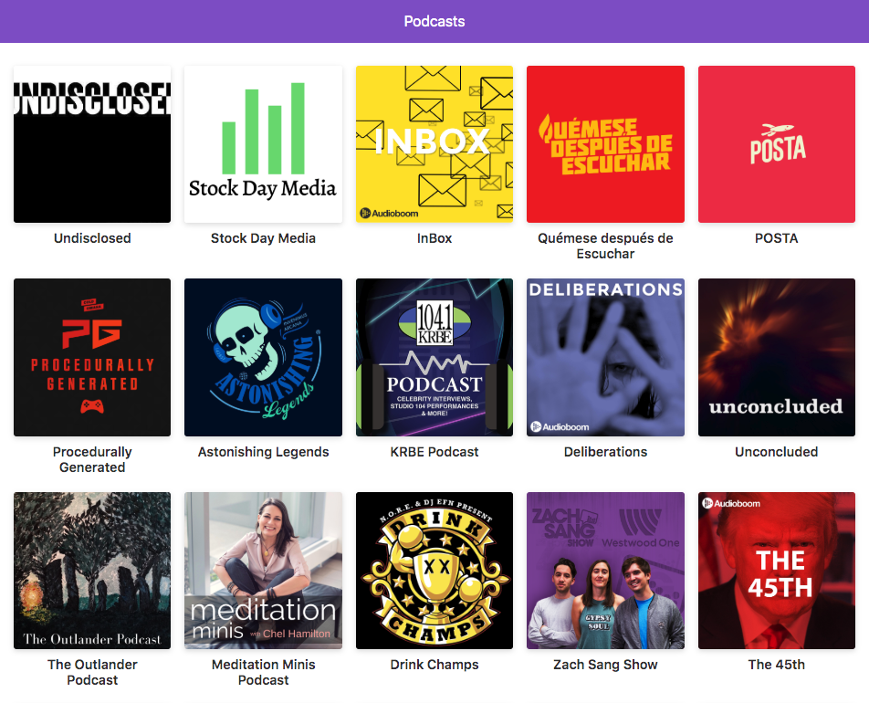

# App de postcast con Next.js

Proyecto de muestra del curso de Next.js de Platzi. Muestra los canales recomendados de la API de audioboom. Lista de series, audios y reproductor.

[Aplicación funcionando ](https://podcast.pquinteros.now.sh/)

  

## Instalación
Puedes ejecutar estos comandos para usarlo.

* `npm install` para instalar las dependencias.
* `npm run dev` para el entorno de desarrollo.
* `npm run build && run start` para el entorno de producción.

## Licencia

MIT
